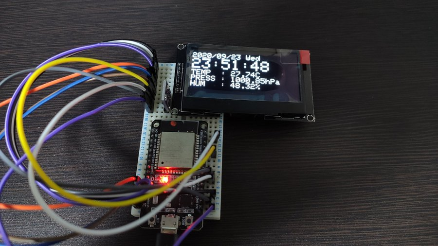

# BME280_oLED_Display

BME280センサを利用し、oLEDモジュールへ計測結果などを表示するプログラム.
マイコンにはESP32 Dev Moduleを使用.
BME280からのデータ取得はI2Cを使用し、oLEDモジュール(SSD1309)ヘのデータ転送にはSPIを使用.

BME280_server と組み合わせることで、複数センサの値を表示することが出来ます.

# 参照
[BME280 - スイッチサイエンス](http://trac.switch-science.com/wiki/BME280)
